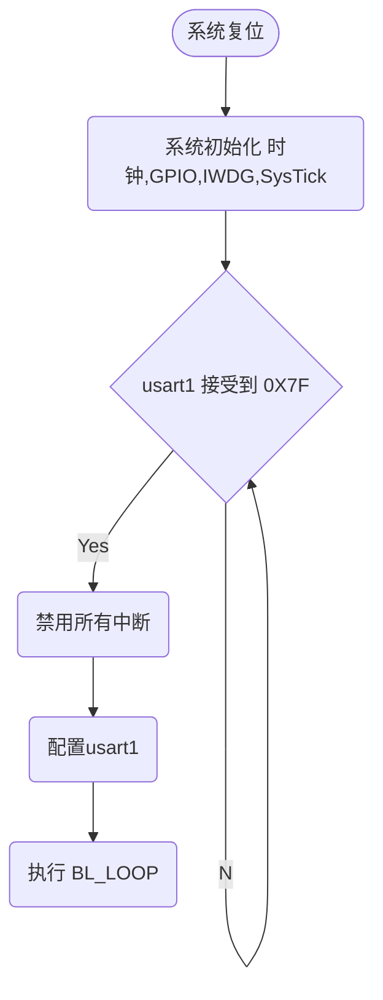

最近购买的 stm32 开发板上有一个一键下载电路，声称可以不用短接 BOOT0 即可可以使用软件控制完成 stm32 固件下载，非常方便。
于是便研究来一下这个电路的原理。

首先需要了解原本 stm32 本身如何使用串口进行下载,于是找到了这些参考资料：

依据[AN2606](https://www.st.com/resource/en/application_note/cd00167594-stm32-microcontroller-system-memory-boot-mode-stmicroelectronics.pdf))
所述，stm32 器件可以使用串行端口使用预定义的协议下载代码。根据不同的 stm32 可以使用不同的串行外设：

- USART,[AN3155](https://www.st.com/resource/en/application_note/cd00264342-usart-protocol-used-in-the-stm32-bootloader-stmicroelectronics.pdf)
- CAN,[AN3154](https://www.st.com/resource/en/application_note/an3154-can-protocol-used-in-the-stm32-bootloader-stmicroelectronics.pdf)
- I2C,[AN4221](https://www.st.com/resource/en/application_note/an4221-i2c-protocol-used-in-the-stm32-bootloader-stmicroelectronics.pdf)
- USB,[AN3156](https://www.st.com/resource/en/application_note/cd00264379-usb-dfu-protocol-used-in-the-stm32-bootloader-stmicroelectronics.pdf)

## STM32 USART bootloader

由于使用的是 stm32f103c8t6, 根据 AN2606 中 15.1 节 Bootloader configuration:

> The STM32F10xxx bootloader is activated by applying Pattern 1 (described in Table 2:Bootloader activation patterns).
> Table 29 shows the hardware resources used by this bootloader.

查询到 stm32f10xxx 系列进入 bootloader 需要在复位期间配置为 Boot0(pin) = 1 and Boot1(pin) = 0 ,也就是使 BOOT0 引脚保持高电平，使 BOOT1 引脚保持低电平

且 bootloader 使用了 `USART1` 外设,所以需要将串行接口直接连接到 USART1_RX (PA10) 和 USART1_TX (PA9) 引脚。

bootloader 程序逻辑图:



简单来说就是：

- 短接 BOOT0 和 VCC，以保持 BOOT0 在启动时高电平。
- 使用 usb 连接到开发板。一般开发板会使用 cp2102 pl2303 或者 ch340 等串口转 usb 芯片来将 usart1 转换为 usb 协议。
- 保持短接，上电后 stm32 会以 bootloader 模式启动。
- 上位机通过 usb 控制 usart 向 usart1 发送 0x7F 以示准备完成。此时 stm32 进入 BL_LOOP。
- 根据 AN3155 中的协议进行交互，完成程序下载以及其他操作。
- 通信完成后，可以通过硬件复位或者软件复位退出 bootloader。（由于硬件复位会清除 sram 中的数据，一般会在完成后使用 协议中的 go 命令从合适的位置继续执行，而避免硬件复位，这对临时调试非常有用，可以避免烧写 flash）

## 一键下载电路及其原理

根据上述的 stm32 进入 bootloader 模式的要求，需要在启动时使 BOOT0 引脚保持高电平，使 BOOT1 引脚保持低电平。

**一般这一步骤需要手动操作,如果能够将这一步通过软件进行控制,就可以能够做到完全一键下载.**

许多开发板都有一键下载电路，核心电路图大概是这样：


思路：

1. 假设开发板以正常模式运行并通过 usb 连接至上位机，RTS# 和 DTR# 初始状态时为高电平
2. 使 RTS# 为低电平，此时 Q1 Q2 导通 NRST 为低电平,BOOT0 为高电平，MCU 处于复位状态 （硬件复位）
3. 延时 100 ms，等待复位完成
4. 使 DTR# 为低电平 Q1 断开，NRET 为高电平，MCU 启动。
5. 由于此时 BOOT0 为高电平,BOOT1 为低电平。复位后在 SYSCLK 的第四个上升沿锁存 BOOT 引脚的值， stm32 启动进入 bootloader 模式。
6. 上位机控制 usart1 发送 0x7F 开始协议，协议细节参考 AN3155。
7. 上位机通过 usart1 下载程序至 sram 或 flash，完成后使用协议中 go 命令从 sram 继续执行或者重复步骤 2 进行复位。

那么需要如何操作才能使 RTS# 或 DTR# 为低电平呢?

需要了解 [rs232](https://en.wikipedia.org/wiki/RS-232) 协议,在协议中仅 TxD,DTR,RTS pin 可以为输出模式，
由于 uart 仅使用 TxD，RxD 就可以完成数据收发，DTR,RTS 得以闲置因此可以用作自定义用途。

以及 linux 串口启动程序实现中关于何如控制串口设备:

**此处缺失资料...**

可以简单理解为：

- 上位机设置 RTS 为高电平时，RTS# 为低电平，反之为高电平
- 上位机设置 DTR 为高电平时，DTR# 为低电平，反之为高电平

## 工具

了解原理后，可以选择合适的工具来帮我们完成上述工作，而无需自己编写上位机程序。

可选工具：

- [stm32flash](https://sourceforge.net/projects/stm32flash)，开源软件，专门针对 stm32 设计，支持自定义 usart 控制，支持一键下载电路。
- [STM32CubeProgrammer](https://www.stmicroelectronics.com.cn/en/development-tools/stm32cubeprog.html)，st 官方工具，功能非常全面，涵盖 ST 所有芯片，但闭源。
- [dfu-util](http://dfu-util.sourceforge.net)，dfu 协议工具，支持使用 usb 外设的 stm32 系列，遗憾的是 stm32f103c8t6 并不支持 usb 直连的 DFU 下载方式。

最终选择 stm32flash ，因为在 linux 和 macos 下获取非常方便且开源,方便了解更多实现细节。

> windows 系统下可以选择 mcuisp 或者叫 fly mcu 的软件进行下载，简单方便。
> 但使用这种工具并不方便我们了解实现原理，而且也不知道这些软件是否“安全”。

使用方式：

```sh
# 自动进入 bootloader 将 rom.bin 烧录进 stm32 且在烧录完成后重启
sudo stm32flash -i '-dtr,dtr:-dtr,dtr&-rts' -w rom.bin  /dev/cu.usbserial-10
```

其中 `-i` 参数是 GPIO 执行序列：

- `dtr`, `rts` or `brk` 表示设置对应串口的引脚为高电平，数字代表将对应的 GPIO。
- `,` 表示添加 100ms 延迟。
- `&` 表示两个动作同时执行。
- `-` 表示取消设置信号,也就是置为低电平。
- `:` 表示分割启动序列后退出序列，':' 后面的序列会在烧录完成后执行。
