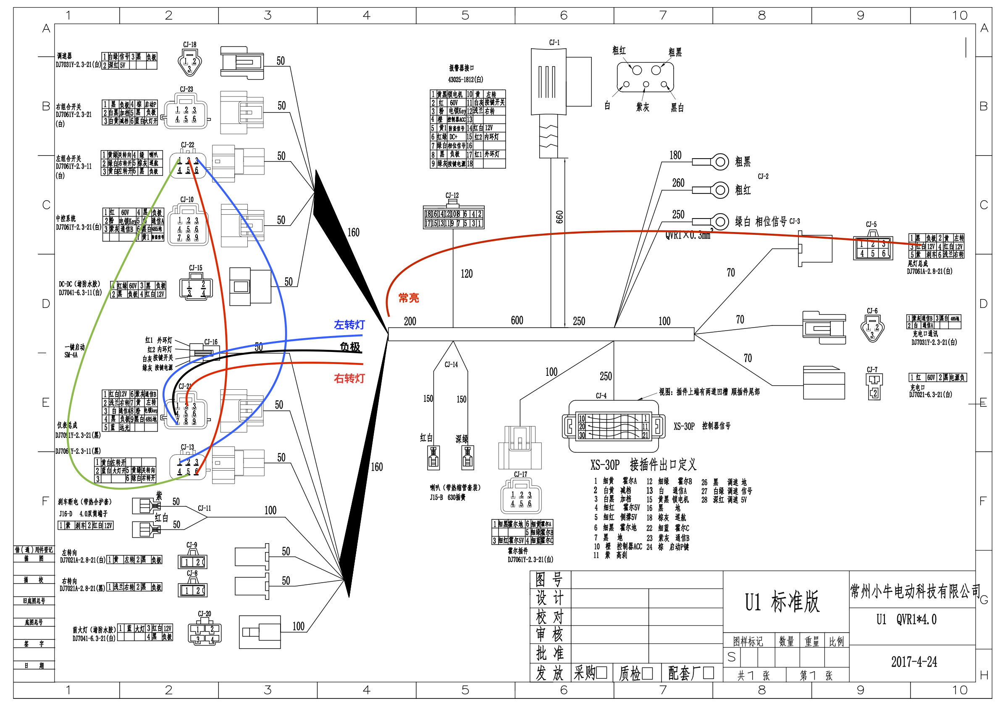

# 小牛 uqis 加装转向灯

## 原理图

小牛系列电动车的灯光信号部分大致都是相同的，小牛 uqi 为有转向灯，小牛 uqis 为没有转向灯，但两个型号外观仪表盘相同，猜测可以自主加装转向灯。

但是无法找到 uqi 型号的原理图，通过参考小牛 U1 原理图可获得转向灯接线和加装方式。小牛 U1 UQi 系列原理相同。

## 物料清单

控制部分：

- 小牛 U1/UQI 左组合开关 \*1
- DJ7021A-2.3 公端子 \*6
- DJ7021A-2.3 母端子 \*2

> DJ7021A-2.3 公母端子可以搜索 “汽车防水接头端子”

报警器部分(非必要)：

- 5556/5557 mx4.2MM 母端子 \*2

后转向灯部分：

- LED 流水转向灯 \*1 对
- 小牛后转向灯支架 \*1

前转向灯部分(非必要)：

- LED 流水转向灯 \*1 对
- 小牛前转向灯支架 \*1 对

接线部分：

- 0.3 平方或以上铜线 \* 8m(或以上)
- 子弹头 3.5MM 接线母端子 \*8 个
- 子弹头 3.5MM 一分二接线端子 \*2 ，用于夜间行车灯常亮一分二
- 防水胶
- 扎带

> 可能不全，按照原理图根据实际情况需要购买

## 接线方式

控制部分：

控制部分由左组合开关连接至仪表盘，由组合开关控制转向灯开启/关闭信号，仪表盘输出至转向灯负载。

- 替换左组合开关
- 按照《U1 原理图》引出 6pin 左组合开关 1、2、3 号位连接线
- 按照原理图分别将上述三条连接线连接至仪表总成 6pin 接头（仪表总成有两个接头）的 5、6、1 号位

负载部分：

- 按照原理图引出仪表总成 9pin 接头的 2 号位（右转灯）和 7 号位（左转灯）作为转向灯 + 极
- 可以从 4 号位引出作为转向灯 - 极，也可取尾灯的负极作为负极

由于转向灯是三线接头，分别为转向灯、夜间行车灯（常亮）、负极,所以还差夜间行车灯。夜间行车灯可以从尾灯的夜间行车灯取电。

报警器部分：

- 根据原理图中报警器端口定义接线
