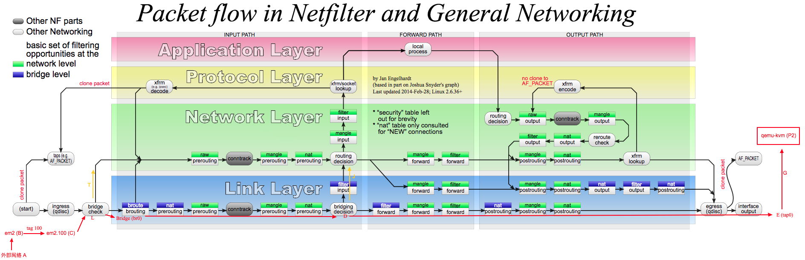

kube-proxy 时 kubernetes 中负责处理 service 相关流量的组件，其功能包含 service 至 pods 转发，service nodeport ，service loadbalancerIP 等

## iptables 模式

本节介绍了 iptables 模式下 service 处理流量的方式。

iptables 简介



iptables 由四个 table 组成，每个 table 中**可能**有 PREROUTING，POSTROUTING，INPUT，FORWARD，OUTPUT 等 5 个 chain。每个 chain 中有数条 rule，按照顺序执行。
除了默认的 chain 外还可以创建自定义的 chain 和 rule，使用 `--jump CHAIN_NAME` 可以从一个 chain 跳转至另一个 chain 。

具体看上图，如果看懂了就懂了。

除了上图中描述的部分外，iptables 还提供了许多 module 和默认的 chain。

这些默认的 chain 常见的有：

- `DNAT`,目的地址转换。示例：`-j DNAT --to-destination 10.12.32.121:6443`
- `SNAT`,源地址转换。示例`-j SNAT 10.12.0.10`
- `MASQUERADE`，地址伪装。可以认为时 SNAT 的扩展，理解为自动从当前的出口 IP 动态选择一个未使用的端口进行 SNAT。 `-j MASQUERADE`
- `RETURN`,停止当前 chain 中 rule 匹配并返回。 `-j RETURN`
- `MARK`,数据包标记。 `-j MARK --set-xmark 0x0/0xf0000`
- `ACCEPT`,接受数据包并跳过该阶段。 `-j ACCEPT`
- `DROP`,丢弃数据包。 `-j DROP`

iptables 在每个 table 的默认 chain 上会设置默认策略：

```sh
$ sudo iptables -t filter -S
-P INPUT ACCEPT
-P FORWARD ACCEPT
-P OUTPUT ACCEPT
```

可选策略有三种： DROP ACCEPT DENY,例如 iptables 默认的 filter table FORWARD chain 策略为 DENY 时则表示拒绝转发数据包。

### service ip

流量进入 linux 网络栈后，经过 raw 的 PREROUTING，mangle 的 PREROUTING ，nat 的 PREROUTING。

```sh
$ sudo iptables -t raw -S PREROUTING
-P PREROUTING ACCEPT
```

在 raw 之后，conntrack 会记录该连接的元数据，即源地址端口和目的地址端口，后续的 mark 与 nat 均会使用到。

```sh
$ sudo iptables -t mangle -S PREROUTING
-P PREROUTING ACCEPT
```

```sh
$ sudo iptables -t nat -S PREROUTING
-P PREROUTING ACCEPT
...
-A PREROUTING -m comment --comment "kubernetes service portals" -j KUBE-SERVICES
```

我们在集群中创建了一个名称为 "defalut/nginx" 的 service 并设置成为了 LoadBalancer 模式。情况如下：

- service ip 为 `10.99.118.99`
- nodeport 为 30259
- 当前 node ip 为 `10.12.32.121`
- external ip 为 `10.12.32.160`
- service 有两个 pod IP 为 `10.116.79.4`(node ip:10.12.32.194) `10.126.142.7`(node ip:10.12.32.121)

继续看 KUBE-SERVICES chain:

```sh
$ sudo iptables -t nat -S KUBE-SERVICES
-N KUBE-SERVICES
...
-A KUBE-SERVICES -d 10.99.118.99/32 -p tcp -m comment --comment "default/nginx cluster IP" -m tcp --dport 80 -j KUBE-SVC-2CMXP7HKUVJN7L6M
-A KUBE-SERVICES -d 10.12.32.160/32 -p tcp -m comment --comment "default/nginx loadbalancer IP" -m tcp --dport 80 -j KUBE-FW-2CMXP7HKUVJN7L6M
-A KUBE-SERVICES -m comment --comment "kubernetes service nodeports; NOTE: this must be the last rule in this chain" -m addrtype --dst-type LOCAL -j KUBE-NODEPORTS
```

1. KUBE-SERVICES 分别判断了目标地址若为 serviceip:serviceport 或者 loadbalancerip:serviceport 则进入 KUBE-SVC-2CMXP7HKUVJN7L6M chain。
2. 否则使用 module addrtype 和参数 --dst-type LOCAL 进行匹配，若成功则进入 KUBE-NODEPORTS chain。
   [iptables](https://linux.die.net/man/8/iptables) addrtype dst-type LOCAL 为判断,
   **这里的 local 判断是是否目的地址为任意的本机 IP 地址，若为非本机的地址则忽略，继续进行匹配**。
   > local - the destinations are assigned to this host. The packets are looped back and delivered locally.

先看 KUBE-NODEPORTS:

```sh
$ sudo iptables -t nat -S KUBE-NODEPORTS
-N KUBE-NODEPORTS
-A KUBE-NODEPORTS -p tcp -m comment --comment "default/nginx" -m tcp --dport 30259 -j KUBE-MARK-MASQ
-A KUBE-NODEPORTS -p tcp -m comment --comment "default/nginx" -m tcp --dport 30259 -j KUBE-SVC-2CMXP7HKUVJN7L6M
```

1. 如果是 nodeport 因为涉及到了端口映射，所以被标记了 MARK-MASQ 。
2. 后续和直接访问 service ip 相同，跳转至 KUBE-SVC-2CMXP7HKUVJN7L6M chain。

KUBE-MARK-MASQ：

```sh
$ sudo iptables -t nat -S KUBE-MARK-MASQ
-N KUBE-MARK-MASQ
-A KUBE-MARK-MASQ -j MARK --set-xmark 0x4000/0x4000
```

KUBE-SVC-2CMXP7HKUVJN7L6M:

```sh
$ sudo iptables -t nat -S KUBE-SVC-2CMXP7HKUVJN7L6M
-N KUBE-SVC-2CMXP7HKUVJN7L6M
-A KUBE-SVC-2CMXP7HKUVJN7L6M -m comment --comment "default/nginx" -m statistic --mode random --probability 0.50000000000 -j KUBE-SEP-W2CWN7JE2C7UP3WC
-A KUBE-SVC-2CMXP7HKUVJN7L6M -m comment --comment "default/nginx" -j KUBE-SEP-CSOPB252KCSQF5UB
```

1. `-m statistic --mode random --probability 0.50000000000` 表示使用了 statistic 模块，random 模式 有 0.5 的概率被匹配，若匹配则 `-j KUBE-SEP-W2CWN7JE2C7UP3WC`。
2. 若不匹配则 `-j KUBE-SEP-CSOPB252KCSQF5UB`

上述规则是在副本数为 2 的 service 中，若副本数为其他则此处的概率有所不同。

KUBE-SEP-W2CWN7JE2C7UP3WC:

```sh
$ sudo iptables -t nat -S KUBE-SEP-W2CWN7JE2C7UP3WC
-N KUBE-SEP-W2CWN7JE2C7UP3WC
-A KUBE-SEP-W2CWN7JE2C7UP3WC -s 10.116.79.4/32 -m comment --comment "default/nginx" -j KUBE-MARK-MASQ
-A KUBE-SEP-W2CWN7JE2C7UP3WC -p tcp -m comment --comment "default/nginx" -m tcp -j DNAT --to-destination 10.116.79.4:80
```

1. 如果源地址为 pod ip，则标记 MARK-MASQ。（这种情况不会是 pod local，更像是外部的源地址和容器源地址冲突时的解决方案。）
2. 设置 DNAT 将数据包目的地址更改为 10.116.79.4:80。 这里的目的地址有许多情况：
   1. 目的地址为 service ip:serviceport
   2. 目的地址为 nodeip:nodeport
   3. 目的地址为 loadbalancerip:serviceport
   4. 目的地址为 externalip:serviceport(externalip 和 loadbalancerip 似乎相同)

KUBE-SEP-CSOPB252KCSQF5UB:

```sh
$ sudo iptables -t nat -S KUBE-SEP-CSOPB252KCSQF5UB
-N KUBE-SEP-CSOPB252KCSQF5UB
-A KUBE-SEP-CSOPB252KCSQF5UB -s 10.126.142.7/32 -m comment --comment "default/nginx" -j KUBE-MARK-MASQ
-A KUBE-SEP-CSOPB252KCSQF5UB -p tcp -m comment --comment "default/nginx" -m tcp -j DNAT --to-destination 10.126.142.7:80
```

至此，PREROUTING 链中 KUBE-SERVICES 处理完成。若 PREROUTING 中还有其他 rule 则继续处理(例如 calico 的规则)，但和 kube-proxy 相关的部分已经完成了。

上述阶段完成后数据包的目的地址已经被改变了，此时会进行路由选择。

这里有几种情况：

1. 假设上述 KUBE-SERVICES 将目的地址改变为了 10.126.142.7:80，即该 pod ip 在本机,则转入各 table 的 INPUT chain 处理。
2. 假设上述 KUBE-SERVICES 将目的地址改变为了 10.116.79.4:80 ，即该 pod ip 在其他机器，则转入各 table 的 FORWARD chain 处理。

对于第一种情况：

依次查看 INPUT chain：

```sh
$ sudo iptables -t mangle -S INPUT
-P INPUT ACCEPT
$ sudo iptables -t filter -S INPUT
-P INPUT ACCEPT
-A INPUT -m comment --comment "cali:Cz_u1IQiXIMmKD4c" -j cali-INPUT
-A INPUT -m comment --comment "kubernetes health check service ports" -j KUBE-NODEPORTS
-A INPUT -m conntrack --ctstate NEW -m comment --comment "kubernetes externally-visible service portals" -j KUBE-EXTERNAL-SERVICES
-A INPUT -j KUBE-FIREWALL
$ sudo iptables -t filter -S KUBE-NODEPORTS
-N KUBE-NODEPORTS
$ sudo iptables -t filter -S KUBE-EXTERNAL-SERVICES
-N KUBE-EXTERNAL-SERVICES
```

1. filter 表主要做一些拦截过滤操作，`-j cali-INPUT` 中有关于 network policy 的一些规则，这里先不关注。
2. filter KUBE-NODEPORTS chain 用于尚未知，但似乎和 externalTrafficPolicy 为 Local 时有关。
3. KUBE-EXTERNAL-SERVICES 主要处理 external service 的，可能会在这里做转发，会有一次对 external endpoint 访问的 NAT。

后续的处理会进入网络栈中的传输层，通过 IP 端口寻找对应的应用程序将数据移交给应用程序。

待应用处理后生成回程数据包，首先进行路由选择，后进入各 table 的 OUTPUT chain。

这里的目的路由地址为来程数据包的源地址，有几种情况：

1. 该地址为容器网络地址，对于该情形会根据网络插件的实现进行数据包发送。
2. 该地址为局域网地址
3. 该地址为广域网地址

依次查看 OUTPUT chain：

```sh
s$ sudo iptables -t raw -S OUTPUT
-P OUTPUT ACCEPT
-A OUTPUT -m comment --comment "cali:tVnHkvAo15HuiPy0" -j cali-OUTPUT
```

在 raw table 后会涉及 conntrack 模块 nf_conntrack_confirm() 相关。
conntrack 会记得进入 output 的数据包对应的连接，若为同一个连接则在 PREROUTING 阶段的 mark 在这里依旧可用。
conntrack 的记录使得 MASQUERADE 这类功能能够正常工作。

```sh
$ sudo iptables -t mangle -S OUTPUT
-P OUTPUT ACCEPT
```

mangle table 直接通过。

在 mangle 阶段如果对目的地址进行了更改，会在此阶段后重新选择路由。

```sh
$ sudo iptables -t nat -S OUTPUT
-P OUTPUT ACCEPT
-A OUTPUT -m comment --comment "cali:tVnHkvAo15HuiPy0" -j cali-OUTPUT
-A OUTPUT -m comment --comment "kubernetes service portals" -j KUBE-SERVICES
...
```

```sh
$ sudo iptables -t nat -S KUBE-SERVICES
-N KUBE-SERVICES
...
-A KUBE-SERVICES -d 10.106.147.222/32 -p tcp -m comment --comment "default/nginx cluster IP" -m tcp --dport 80 -j KUBE-SVC-2CMXP7HKUVJN7L6M
-A KUBE-SERVICES -d 10.12.32.160/32 -p tcp -m comment --comment "default/nginx loadbalancer IP" -m tcp --dport 80 -j KUBE-FW-2CMXP7HKUVJN7L6M
...
-A KUBE-SERVICES -m comment --comment "kubernetes service nodeports; NOTE: this must be the last rule in this chain" -m addrtype --dst-type LOCAL -j KUBE-NODEPORTS
```

nat OUTPUT 与 PREROUTING 均会进入 KUBE-SERVICES chain

1. 与 PREROUTING 类似（为外部流量访问 service 做处理），OUTPUT 是为本机流量（pod 内/node 访内）访问 service 做处理。
2. 在这个场景中，流量是来自外部的所以不会匹配到这里的任意一条规则。

```sh
$ sudo iptables -t filter -S OUTPUT
-P OUTPUT ACCEPT
-A OUTPUT -m comment --comment "cali:tVnHkvAo15HuiPy0" -j cali-OUTPUT
-A OUTPUT -m conntrack --ctstate NEW -m comment --comment "kubernetes service portals" -j KUBE-SERVICES
-A OUTPUT -j KUBE-FIREWALL
```

```sh
$ sudo iptables -t filter -S  KUBE-SERVICES
-N KUBE-SERVICES
```

没有额外处理

```sh
$ sudo iptables -t filter -S  KUBE-FIREWALL
-N KUBE-FIREWALL
-A KUBE-FIREWALL -m comment --comment "kubernetes firewall for dropping marked packets" -m mark --mark 0x8000/0x8000 -j DROP
-A KUBE-FIREWALL ! -s 127.0.0.0/8 -d 127.0.0.0/8 -m comment --comment "block incoming localnet connections" -m conntrack ! --ctstate RELATED,ESTABLISHED,DNAT -j DROP
```

1. filter OUTPUT 对 MARK-DROP 的数据包和源地址非 local 的 loop back 数据包进行的了 DROP。

mangle POSTROUTING：

```sh
$ sudo iptables -t mangle -S POSTROUTING
-P POSTROUTING ACCEPT
-A POSTROUTING -m comment --comment "cali:O3lYWMrLQYEMJtB5" -j cali-POSTROUTING
```

没有额外处理

nat POSTROUTING：

```sh
$ sudo iptables -t nat -S POSTROUTING
-P POSTROUTING ACCEPT
-A POSTROUTING -m comment --comment "cali:O3lYWMrLQYEMJtB5" -j cali-POSTROUTING
-A POSTROUTING -m comment --comment "kubernetes postrouting rules" -j KUBE-POSTROUTING
```

nat KUBE-POSTROUTING：

```sh
$ sudo iptables -t nat -S KUBE-POSTROUTING
-N KUBE-POSTROUTING
-A KUBE-POSTROUTING -m mark ! --mark 0x4000/0x4000 -j RETURN
-A KUBE-POSTROUTING -j MARK --set-xmark 0x4000/0x0
-A KUBE-POSTROUTING -m comment --comment "kubernetes service traffic requiring SNAT" -j MASQUERADE --random-fully
```

1. `--mark 0x4000/0x4000` 若携带此标记的连接的数据包会自动执行 MASQUERADE,使用 conntrack 中记录的已有连接对数据包进行更改。
2. 若未被标记 masq 的数据包保持原状。

对于第一种情况，这里会保持原状传输。

完成。

对于第二种情况：即在路由选择后判断不是本机地址的。

会依次经过 mangle FORWARD，filter FORWARD，mangle POSTROUTING，nat POSTROUTING。依次来看：

```sh
$ sudo iptables -t mangle -S FORWARD
-P FORWARD ACCEPT
```

没有额外处理

```sh
$ sudo iptables -t filter -S FORWARD
-P FORWARD ACCEPT
-A FORWARD -m comment --comment "cali:wUHhoiAYhphO9Mso" -j cali-FORWARD
-A FORWARD -m comment --comment "kubernetes forwarding rules" -j KUBE-FORWARD
-A FORWARD -m conntrack --ctstate NEW -m comment --comment "kubernetes service portals" -j KUBE-SERVICES
-A FORWARD -m conntrack --ctstate NEW -m comment --comment "kubernetes externally-visible service portals" -j KUBE-EXTERNAL-SERVICES
-A FORWARD -m comment --comment "cali:S93hcgKJrXEqnTfs" -m comment --comment "Policy explicitly accepted packet." -m mark --mark 0x10000/0x10000 -j ACCEPT
-A FORWARD -m comment --comment "cali:mp77cMpurHhyjLrM" -j MARK --set-xmark 0x10000/0x10000
```

filter KUBE-FORWARD:

```sh
$ sudo iptables -t filter -S KUBE-FORWARD
-N KUBE-FORWARD
-A KUBE-FORWARD -m conntrack --ctstate INVALID -j DROP
-A KUBE-FORWARD -m comment --comment "kubernetes forwarding rules" -m mark --mark 0x4000/0x4000 -j ACCEPT
-A KUBE-FORWARD -m comment --comment "kubernetes forwarding conntrack pod source rule" -m conntrack --ctstate RELATED,ESTABLISHED -j ACCEPT
-A KUBE-FORWARD -m comment --comment "kubernetes forwarding conntrack pod destination rule" -m conntrack --ctstate RELATED,ESTABLISHED -j ACCEPT
```

1. 对于所有流量均 `--mark 0x4000/0x4000`,该标记与 MARK-MASQ 使用相同标记。在后续的 nat POSTROUTING 阶段会对该标记的数据包进行伪装。
2. 对已经建立额连接直接 ACCEPT
3. 对`--ctstate NEW`新建连接执行 filter KUBE-SERVICES，filter KUBE-EXTERNAL-SERVICES，这与第一种情形的 output 中为相同的处理。
4. 此外 calico 也在此处做了网络策略。

mangle POSTROUTING：

```sh
$ sudo iptables -t mangle -S POSTROUTING
-P POSTROUTING ACCEPT
-A POSTROUTING -m comment --comment "cali:O3lYWMrLQYEMJtB5" -j cali-POSTROUTING
```

没有额外处理

nat POSTROUTING：

```sh
$ sudo iptables -t nat -S POSTROUTING
-P POSTROUTING ACCEPT
-A POSTROUTING -m comment --comment "cali:O3lYWMrLQYEMJtB5" -j cali-POSTROUTING
-A POSTROUTING -m comment --comment "kubernetes postrouting rules" -j KUBE-POSTROUTING
```

nat KUBE-POSTROUTING：

```sh
$ sudo iptables -t nat -S KUBE-POSTROUTING
-N KUBE-POSTROUTING
-A KUBE-POSTROUTING -m mark ! --mark 0x4000/0x4000 -j RETURN
-A KUBE-POSTROUTING -j MARK --set-xmark 0x4000/0x0
-A KUBE-POSTROUTING -m comment --comment "kubernetes service traffic requiring SNAT" -j MASQUERADE --random-fully
```

对于第二种情况，这里会走 MASQUERADE 进行地址转换。

由于这种 NAT 情况的发生，会导致后续的数据包被改变，使得容器内获取到的地址为本机的 NAT 地址，数据包的源地址在这里丢失。

在 service 中提供了 spec.externalTrafficPolicyType "Local" 做备选，即从 node （NodePort 或者 LoadBalancer IP） 进入的数据仅能被发送到该 node 上存在的 pod。
即上述的第一种情况，对于第二种情况，会在 nat PREROUTING 阶段失败，避免将流量向后转发。

下面是 Local 策略时 pod 存在的 node 和不存在 pod 的 node

```sh
sudo iptables -t nat -S KUBE-SERVICES
-N KUBE-SERVICES
-A KUBE-SERVICES -d 10.106.147.222/32 -p tcp -m comment --comment "default/nginx cluster IP" -m tcp --dport 80 -j KUBE-SVC-2CMXP7HKUVJN7L6M
-A KUBE-SERVICES -d 10.12.32.160/32 -p tcp -m comment --comment "default/nginx loadbalancer IP" -m tcp --dport 80 -j KUBE-FW-2CMXP7HKUVJN7L6M

    -N KUBE-FW-2CMXP7HKUVJN7L6M
    -A KUBE-FW-2CMXP7HKUVJN7L6M -m comment --comment "default/nginx loadbalancer IP" -j KUBE-XLB-2CMXP7HKUVJN7L6M
    -A KUBE-FW-2CMXP7HKUVJN7L6M -m comment --comment "default/nginx loadbalancer IP" -j KUBE-MARK-DROP

        -N KUBE-XLB-2CMXP7HKUVJN7L6M
        -A KUBE-XLB-2CMXP7HKUVJN7L6M -m comment --comment "masquerade LOCAL traffic for default/nginx LB IP" -m addrtype --src-type LOCAL -j KUBE-MARK-MASQ
        -A KUBE-XLB-2CMXP7HKUVJN7L6M -m comment --comment "route LOCAL traffic for default/nginx LB IP to service chain" -m addrtype --src-type LOCAL -j KUBE-SVC-2CMXP7HKUVJN7L6M
        -A KUBE-XLB-2CMXP7HKUVJN7L6M -m comment --comment "Balancing rule 0 for default/nginx" -j KUBE-SEP-AXV2DHXTM4UOSW2H
```

1. 本机（node）上存在 pod 时直接进入本机。

```sh
$ sudo iptables -t nat -S KUBE-SERVICES
-N KUBE-SERVICES
-A KUBE-SERVICES -d 10.106.147.222/32 -p tcp -m comment --comment "default/nginx cluster IP" -m tcp --dport 80 -j KUBE-SVC-2CMXP7HKUVJN7L6M
-A KUBE-SERVICES -d 10.12.32.160/32 -p tcp -m comment --comment "default/nginx loadbalancer IP" -m tcp --dport 80 -j KUBE-FW-2CMXP7HKUVJN7L6M

    -N KUBE-FW-2CMXP7HKUVJN7L6M
    -A KUBE-FW-2CMXP7HKUVJN7L6M -m comment --comment "default/nginx loadbalancer IP" -j KUBE-XLB-2CMXP7HKUVJN7L6M
    -A KUBE-FW-2CMXP7HKUVJN7L6M -m comment --comment "default/nginx loadbalancer IP" -j KUBE-MARK-DROP

        -N KUBE-XLB-2CMXP7HKUVJN7L6M
        -A KUBE-XLB-2CMXP7HKUVJN7L6M -m comment --comment "masquerade LOCAL traffic for default/nginx LB IP" -m addrtype --src-type LOCAL -j KUBE-MARK-MASQ
        -A KUBE-XLB-2CMXP7HKUVJN7L6M -m comment --comment "route LOCAL traffic for default/nginx LB IP to service chain" -m addrtype --src-type LOCAL -j KUBE-SVC-2CMXP7HKUVJN7L6M
        -A KUBE-XLB-2CMXP7HKUVJN7L6M -m comment --comment "default/nginx has no local endpoints" -j KUBE-MARK-DROP
```

1. 本机（node）上不存在 pod 时直接标记丢弃。

### 小结

iptables 模式下 kube-proxy 负责了 service nodeport loadbalancer 本机部分的数据包处理。

## ipvs 模式

ipvs 模式下 kube-proxy 是将执行 iptables 模式下执行 nat 等转发逻辑使用了 ipvs 来完成。

[wiki/IPVS](http://kb.linuxvirtualserver.org/wiki/IPVS)

ipvs 时内核种的模块，在用户空间可以使用 ipvsadm 命令进行查看和配置。

ipvs 模式也使用到了 iptables 的部分功能，例如在网络策略，防火墙上面依旧使用 iptbles 配置的。

先从 iptables 入手：

kube-proxy 在 raw mangle 的 PREROUTING 链上无额外操作。

```sh
$ sudo iptables -t nat -S PREROUTING
-P PREROUTING ACCEPT
-A PREROUTING -m comment --comment "cali:6gwbT8clXdHdC1b1" -j cali-PREROUTING
-A PREROUTING -m comment --comment "kubernetes service portals" -j KUBE-SERVICES

    -N KUBE-SERVICES
    -A KUBE-SERVICES -m comment --comment "Kubernetes service lb portal" -m set --match-set KUBE-LOAD-BALANCER dst,dst -j KUBE-LOAD-BALANCER
    -A KUBE-SERVICES -m comment --comment "Kubernetes service cluster ip + port for masquerade purpose" -m set --match-set KUBE-CLUSTER-IP src,dst -j KUBE-MARK-MASQ
    -A KUBE-SERVICES -m addrtype --dst-type LOCAL -j KUBE-NODE-PORT
    -A KUBE-SERVICES -m set --match-set KUBE-CLUSTER-IP dst,dst -j ACCEPT
    -A KUBE-SERVICES -m set --match-set KUBE-LOAD-BALANCER dst,dst -j ACCEPT

        -N KUBE-LOAD-BALANCER
        -A KUBE-LOAD-BALANCER -m comment --comment "Kubernetes service load balancer ip + port with externalTrafficPolicy=local" -m set --match-set KUBE-LOAD-BALANCER-LOCAL dst,dst -j RETURN
        -A KUBE-LOAD-BALANCER -j KUBE-MARK-MASQ

        -N KUBE-NODE-PORT
        -A KUBE-NODE-PORT -p tcp -m comment --comment "Kubernetes nodeport TCP port with externalTrafficPolicy=local" -m set --match-set KUBE-NODE-PORT-LOCAL-TCP dst -j RETURN
        -A KUBE-NODE-PORT -p tcp -m comment --comment "Kubernetes nodeport TCP port for masquerade purpose" -m set --match-set KUBE-NODE-PORT-TCP dst -j KUBE-MARK-MASQ
```

解释一下 ipset 的语法:

以`-m set --match-set KUBE-CLUSTER-IP src,dst`为例，
其中`KUBE-CLUSTER-IP`是 ipset 中 set 为`hash:ip,port`类型，
其中`src,dst`表示对应位置的匹配， src 表示匹配源地址，dst 表示匹配目标地址。

1. ipset 中的 KUBE-LOAD-BALANCER 和 KUBE-LOAD-BALANCER-LOCAL 内容目前是一样的为 loadbalanceip:port
2. KUBE-SERVICES 链对 service loadbalancer nodeport 数据包进行了 MASQ 检查和标记。
3. 在离开 iptables nat PREROUTING 后，会进行路由选择。
4. 若目的路由为本机，则进入 INPUT chain，ipvs 在这里开始生效。

INPUT chain:

```sh
$ sudo iptables -t mangle -S INPUT
-P INPUT ACCEPT
$ sudo iptables -t filter -S INPUT
-P INPUT ACCEPT
-A INPUT -m comment --comment "cali:Cz_u1IQiXIMmKD4c" -j cali-INPUT
-A INPUT -m comment --comment "kubernetes health check rules" -j KUBE-NODE-PORT
$ sudo iptables -t filter -S KUBE-NODE-PORT
-N KUBE-NODE-PORT
-A KUBE-NODE-PORT -m comment --comment "Kubernetes health check node port" -m set --match-set KUBE-HEALTH-CHECK-NODE-PORT dst -j ACCEPT
```

继续看 ipvs：

```sh
$ sudo ipvsadm -S -n
# docker
-A -t 172.17.0.1:30470 -s rr
-a -t 172.17.0.1:30470 -r 10.126.142.9:80 -m -w 1

# calico.vxlan
-A -t 10.126.142.0:30470 -s rr
-a -t 10.126.142.0:30470 -r 10.126.142.9:80 -m -w 1

# eth0
-A -t 10.12.32.121:30470 -s rr
-a -t 10.12.32.121:30470 -r 10.126.142.9:80 -m -w 1

# lo
-A -t 127.0.0.1:30470 -s rr
-a -t 127.0.0.1:30470 -r 10.126.142.9:80 -m -w 1

# kube-ipvs0 loadbalancer ip
-A -t 10.12.32.160:80 -s rr
-a -t 10.12.32.160:80 -r 10.126.142.9:80 -m -w 1

# kube-ipvs0 service ip
-A -t 10.106.147.222:80 -s rr
-a -t 10.106.147.222:80 -r 10.126.142.9:80 -m -w 1
```

1. ipvs 模式中，nodeport 会“监听”在被选择网卡的 nodeport 端口。并直接指向 real server。
2. ipvs 模式中，会创建网卡 `kube-ipvs0`,其上附加了 service ip，loadbalancer ip 等。

```sh
$ ip addr show dev kube-ipvs0
20: kube-ipvs0: <BROADCAST,NOARP> mtu 1500 qdisc noop state DOWN group default
    link/ether b6:f2:fa:28:da:1c brd ff:ff:ff:ff:ff:ff
    inet 10.102.169.32/32 scope global kube-ipvs0
       valid_lft forever preferred_lft forever
    inet 10.99.92.93/32 scope global kube-ipvs0
       valid_lft forever preferred_lft forever
    inet 10.110.75.130/32 scope global kube-ipvs0
       valid_lft forever preferred_lft forever
    inet 10.96.0.1/32 scope global kube-ipvs0
       valid_lft forever preferred_lft forever
    inet 10.106.147.222/32 scope global kube-ipvs0
       valid_lft forever preferred_lft forever
    inet 10.12.32.160/32 scope global kube-ipvs0
       valid_lft forever preferred_lft forever
    inet 10.96.0.10/32 scope global kube-ipvs0
       valid_lft forever preferred_lft forever
```

1. 在本机的 ipvs 中，若 externalTrafficPolicy 为 Local 时，对应的 nodeport loadbalancer 的记录中则不会存在远程的 real server。

ipvs 支持三种工作模式，DR,tunl 和 NAT：

```sh
  --gatewaying   -g                   gatewaying (direct routing) (default)
  --ipip         -i                   ipip encapsulation (tunneling)
  --masquerading -m                   masquerading (NAT)
```

在 kube-proxy 中默认是使用的 `-m` NAT 模式。NAT 模式在 real server 位于本地和远程时所使用的转发方式不同。大概在本机的使用 DNAT，在远程的使用 MASQUERADE。

ipvs 根据工作模式对数据包进行修改后重新发出，经过 OUTPUT chain：

```sh
$ sudo iptables -t raw -S OUTPUT
-P OUTPUT ACCEPT
-A OUTPUT -m comment --comment "cali:tVnHkvAo15HuiPy0" -j cali-OUTPUT

$ sudo iptables -t mangle -S OUTPUT
-P OUTPUT ACCEPT

$ sudo iptables -t nat -S OUTPUT
-P OUTPUT ACCEPT
-A OUTPUT -m comment --comment "cali:tVnHkvAo15HuiPy0" -j cali-OUTPUT
-A OUTPUT -m comment --comment "kubernetes service portals" -j KUBE-SERVICES

$ sudo iptables -t filter -S OUTPUT
-P OUTPUT ACCEPT
-A OUTPUT -m comment --comment "cali:tVnHkvAo15HuiPy0" -j cali-OUTPUT
```

1. 在 OUTPUT 链中没有额外操作

经过 OUTPUT chain：

```sh
$ sudo iptables -t mangle -S POSTROUTING
-P POSTROUTING ACCEPT
-A POSTROUTING -m comment --comment "cali:O3lYWMrLQYEMJtB5" -j cali-POSTROUTING

$ sudo iptables -t nat -S POSTROUTING
-P POSTROUTING ACCEPT
-A POSTROUTING -m comment --comment "cali:O3lYWMrLQYEMJtB5" -j cali-POSTROUTING
-A POSTROUTING -m comment --comment "kubernetes postrouting rules" -j KUBE-POSTROUTING

$ sudo iptables -t nat -S KUBE-POSTROUTING
-N KUBE-POSTROUTING
-A KUBE-POSTROUTING -m comment --comment "Kubernetes endpoints dst ip:port, source ip for solving hairpin purpose" -m set --match-set KUBE-LOOP-BACK dst,dst,src -j MASQUERADE
-A KUBE-POSTROUTING -m mark ! --mark 0x4000/0x4000 -j RETURN
-A KUBE-POSTROUTING -j MARK --set-xmark 0x4000/0x0
-A KUBE-POSTROUTING -m comment --comment "kubernetes service traffic requiring SNAT" -j MASQUERADE --random-fully
```

1. 这里与 iptables 模式相同，对 “loop back”流量做了伪装标记，“loop back”流量是源地址和目的地址相同的流量，这部分流量比较特殊，如果放出 node 进入二层交换机可能会因为交换机不支持 hairpin 而遭丢弃就此消失。

结束。

## 问题

Q:为什么 kube-proxy 还需要监听 nodeport 端口？
A:

Q:keepalived 的 L3 VIP 方式和 metallb L2 ARP 方式高可用的优缺点各在哪里？
A:

Q: 在 ipvs 模式中，kube-proxy 为什么增加了名称为`kube-ipvs0`的网卡，并附加了 service ip 和 loadbalancer IP。
A: 用于在路由选择阶段将流量保持在本机并进入 INPUT chain 后进入 ipvs 处理。
这里注意该 kube-ipvs0 网卡的状态为 DOWN，路由可以使用`ip route show table local`查看。

Q: 在 ipvs 模式中，kube-proxy 为什么不选择 DR 或者 tunnel 模式？
A: 先比较 DR 模式和 NAT 模式，DR 模式为直接路由，仅将数据包的 mac 地址做了更改，更改为 real server MAC，则在回程数据包时，
数据包不在经过此 node 而是直接对客户端响应。而 NAT 模式中，ipvs 对数据包进行了 MAQSUERADE（如果在本机则为 SNAT） ，在 L4 上实际建立了两个连接。
使用 DR 模式的限制为无法进行 service->pod 的端口映射以及 conntrack 无法追踪，基于 conntrack 的功能会失效，DR 模式的优势为 ipvs 中转 node 不会成为瓶颈。
